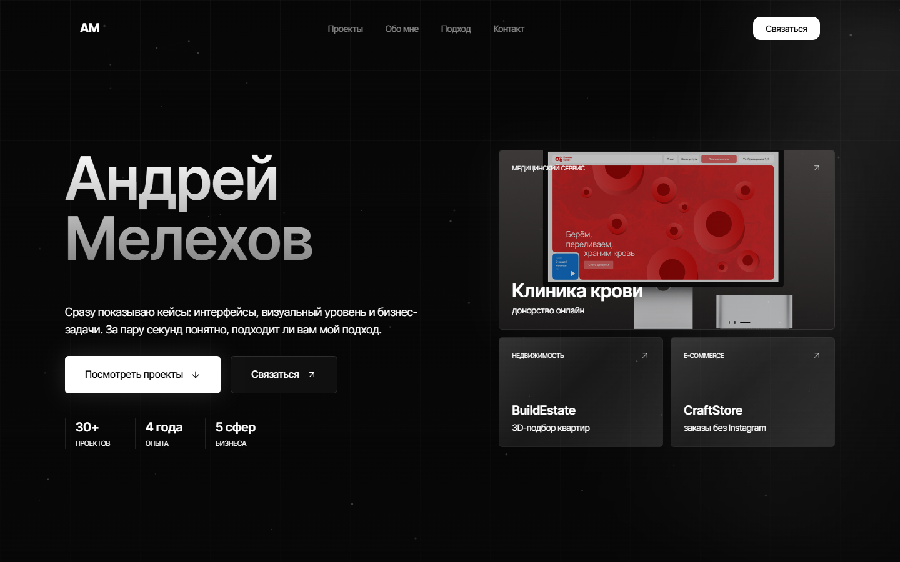

# Andrey Melekhov Portfolio

A dark, responsive portfolio website for presenting selected web projects, development approach, and contact options for potential clients.

[View Live Website](https://melekhovv-my-portfolio.preview.layero.ru/)



## Overview

This portfolio is designed to make the first screen useful within a few seconds: visitors can see the developer name, key positioning, project previews, and direct contact actions without digging through the page.

The site focuses on:

- a strong first-screen portfolio presentation;
- clean dark visual language with white glow accents;
- responsive layouts for desktop and mobile;
- animated interactions powered by Framer Motion;
- case preview cards and detailed project sections;
- a clear contact call to action.

## Tech Stack

| Area | Technology |
| --- | --- |
| Framework | Next.js 14 |
| UI | React 18 |
| Language | TypeScript |
| Styling | Tailwind CSS |
| Animation | Framer Motion |
| Icons | Lucide React |
| Package Manager | npm |

## Features

- Responsive hero section with featured project cards.
- White cursor glow and hover spotlight effects on interactive elements.
- Hero-only particle background.
- Project grid with modal-style case details.
- About, approach, CTA, and footer sections.
- Mobile-friendly navigation and layouts.
- Production-ready Next.js build.

## Live Demo

The published website is available here:

**https://melekhovv-my-portfolio.preview.layero.ru/**

## Getting Started

Clone the repository:

```bash
git clone https://github.com/melekhovv/my-portfolio.git
cd my-portfolio
```

Install dependencies:

```bash
npm install
```

Run the development server:

```bash
npm run dev
```

Open the local site:

```text
http://localhost:3000
```

## Available Scripts

```bash
npm run dev
npm run build
npm run start
npm run lint
```

## Project Structure

```text
public/
  portfolio-preview.png
  projects/
src/
  app/
  components/ui/
  data/
  lib/
```

## Contact

- GitHub: [melekhovv](https://github.com/melekhovv)
- Telegram: [@andrei_melekhov](https://t.me/andrei_melekhov)
- Email: anrewje@gmail.com

## License

This project is licensed under the MIT License.
